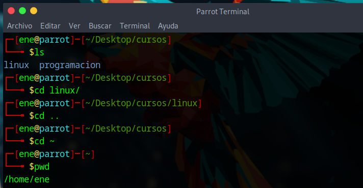
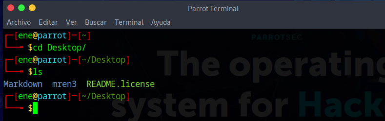
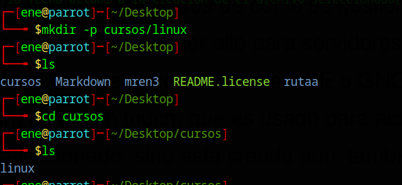

 `Linux` es el sistema operativo mas usado en el mundo, incluso este supera al Internet.
  En Linux, es fundamental, tener conocimientos acerca de como se gestionan los archivos para
  la eficacia, rapidez. Además, es fundamental conocer ello para servidores, ya que estos no
  cuentan con un entorno de escritorio como el Xfce, el Plasma KDE o GNOME.
 .
---
> **Nociones previas**

> No nociones previas requeridas, debido a ello, tratare de explicarlo en est articulo, para asi hacerlo amigable para cualquiera
>

---
# [](#header-1)GUI VS LINEA DE COMANDOS

La **GUI** o interfaz grafica nos permite interactuar con el sistema operativo de manera mas grafica y entendible, para el usuario. __EN mi opinion, esta debe ser la razon por la que windows sigue siendo el mas usado como distribucion principal, ya que los usuarios aun no estan familiarizados con la linea de comandos__. La linea de comandos es _shell_  en ___Linux___ y cli en ___Windows___ que te permite ineractuar con el sistema operativo mediante comandos que aprenderemos en este articulo.

> **Importante!**

> Para comenzar, puedes ir creando archivos mediante comandos y visualizarlo mediante la inetrfaz grafica, es una practica recomendada, para no solo aprender a usar comandos. sino a aprender como funcionan en si
>

---

## [](#header-2)CREACION DE ARCHIVOS EN LINUX

---


### COMANDO PWD

Este comando es bastante util, ya que te permite imprimir en formato simple donde te encuentras ubicado. A  veces solemos tener bastantes directorios dentro de uno y con este comando te permite ubicar de rapida y eficaz


> Retroceder 

> Para poder retroceder un directorio en Linux se usa el ../ para retroceder un directorio


### COMANDO CD 


Este comando es usado para movilizarnos mediante directorios, ya que nos permite, acceder a directorios padre, volver al directorio hijo y volver al directorio raiz





### USOS DE CD:


### COMANDO LS


En Linux se usa bastante el`Comando ls` para listas los directorio, debido a es muy util, por eso lo usaremos bastante en este articulo. 





---


> **Importante!**

## Estructura de los comandos

El comando cuenta con 3 partes, las cuales son:

1. **Comando** = Accion a **ejecutar**
2. **Option**  = Ajusta el **cuerpo** de el comando
3. **Argumento** = _Target_ = objetivo


_Ejemplo_




> En el ejemplo dado, el _comando_ es **mkdir**, la _opcion_ es **-p** y el _argumento_ es **cursos/linux**
>

__"No se procupen si aun no se comprende el uso de el comando mkdir, lo veremos mas adelante en este articulo"__

----

> **Importante!**

> Los comandos en Linux son en el idioma ingles, son abreviaturas de el Ingles, es verdad que se le puede poner alias al comando, si, se podria poner un alias  en tu lengua nativa, en mi caso el español, pero no es recomendado, ya que los comandos en Linux, Windows y la configuracion de siwitches y routers tambien son mediantes comandos abreviados del idioma ingles.

> Desglosandolo a su forma orginal, ya sea un verbo del idioma ingles, podremos asi saber su uso en cualquier momento.
>

### COMANDO TOUCH

Los comandos mas comunes para esto, son `touch`, que es usado para actualizar a la fecha actual a la creación de el archivo seleccionado(previamente creado)

**Ademas**, sino esta creado aun, también lo crea ( debes indicar el formato de el archivo, por ejemplo, .txt .odp).Es importante saber que este comando cera archivos vacios.


i

> Explicacion

> Creamos un archivo llamado con el comando touch llamado *"tarea1.txt1"*, luego verificamos su creacion listando el contenido con el comando ls, luego para comprobar su otro uso, el cua l es actualizar la fecha de un archivo creado,vemos la hora, con el comando **"date +%R"**, luego al volver a introducir el comando con el archivo previamente creado, se actualiza la fe cha a la actual.  
>

---

### COMANDO CP

Es una abreviacion de el verbo copy del idioma ingles, este comando te permite copiar el archivo al destino que le indiquemos, mas no lo borra de donde estaba inicialmente. 


> EXPLICACION

> Cree un directorio llamado programacion previamente para el ejemplo, con el comando cp, copie el archivo **"tarea1.txt"** en la carpeta programacion, retrocedi dos carpetas con ../ y luego accedi a la carpeta programacion, no te preocupes si no entiendes aun muy bien esto ahora, con la partica, se quelo haras, con el comando ls verifique que se encuentra aun tarea1.txt en donde estaba y accedi al directorio de programacion, para corroborar que se haya copiado correctamente, como podemos ver el archivo se mantiene en ambos lados
>


### [](#header-3)Header 3

```js
// Javascript code with syntax highlighting.
var fun = function lang(l) {
  dateformat.i18n = require('./lang/' + l)
  return true;
}
```

```ruby
# Ruby code with syntax highlighting
GitHubPages::Dependencies.gems.each do |gem, version|
  s.add_dependency(gem, "= #{version}")
end
```

#### [](#header-4)Header 4

*   This is an unordered list following a header.
*   This is an unordered list following a header.
*   This is an unordered list following a header.

##### [](#header-5)Header 5

1.  This is an ordered list following a header.
2.  This is an ordered list following a header.
3.  This is an ordered list following a header.

###### [](#header-6)Header 6

| head1        | head two          | three |
|:-------------|:------------------|:------|
| ok           | good swedish fish | nice  |
| out of stock | good and plenty   | nice  |
| ok           | good `oreos`      | hmm   |
| ok           | good `zoute` drop | yumm  |

### There's a horizontal rule below this.

* * *

### Here is an unordered list:

*   Item foo
*   Item bar
*   Item baz
*   Item zip

### And an ordered list:

1.  Item one
1.  Item two
1.  Item three
1.  Item four

### And a nested list:

- level 1 item
  - level 2 item
  - level 2 item
    - level 3 item
    - level 3 item
- level 1 item
  - level 2 item
  - level 2 item
  - level 2 item
- level 1 item
  - level 2 item
  - level 2 item
- level 1 item

### Small image


### Large image


### Definition lists can be used with HTML syntax.

<dl>
<dt>Name</dt>
<dd>Godzilla</dd>
<dt>Born</dt>
<dd>1952</dd>
<dt>Birthplace</dt>
<dd>Japan</dd>
<dt>Color</dt>
<dd>Green</dd>
</dl>

```
Long, single-line code blocks should not wrap. They should horizontally scroll if they are too long. This line should be long enough to demonstrate this.
```

```
The final element.
```
