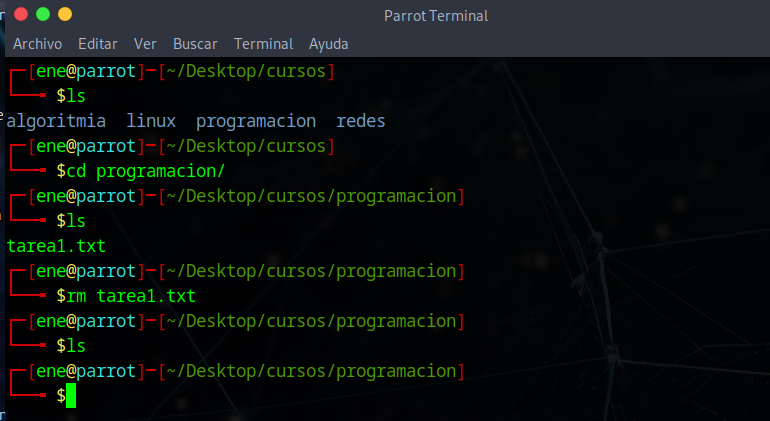

`Linux` es el sistema operativo mas usado en el mundo, incluso este supera al Internet. En Linux, es fundamental, tener conocimientos acerca de como se gestionan los archivos para la eficacia, rapidez. Además, es fundamental conocer ello para servidores, ya que estos no cuentan con un entorno de escritorio como el Xfce, el Plasma KDE o GNOME

---


> **Nociones previas**

> No nociones previas requeridas, debido a ello, tratare de explicarlo en est articulo, para asi hacerlo amigable para cualquiera
>

---
# [](#header-1)GUI VS LINEA DE COMANDOS

La **GUI** o interfaz grafica nos permite interactuar con el sistema operativo de manera mas grafica y entendible, para el usuario. __EN mi opinion, esta debe ser la razon por la que windows sigue siendo el mas usado como distribucion principal, ya que los usuarios aun no estan familiarizados con la linea de comandos__. La linea de comandos es _shell_  en ___Linux___ y cli en ___Windows___ que te permite ineractuar con el sistema operativo mediante comandos que aprenderemos en este articulo.

> **Importante!**

> Para comenzar, puedes ir creando archivos mediante comandos y visualizarlo mediante la inetrfaz grafica, es una practica recomendada, para no solo aprender a usar comandos. sino a aprender como funcionan en si
>

---

## [](#header-2)CREACION DE ARCHIVOS EN LINUX

---


> **Importante!**

## Estructura de los comandos

---

El comando cuenta con 3 partes, las cuales son:

1. **Comando** = Accion a **ejecutar**
2. **Option**  = Ajusta el **cuerpo** de el comando
3. **Argumento** = _Target_ = objetivo


_Ejemplo_


> En el ejemplo dado, el _comando_ es **mkdir**, la _opcion_ es **-p** y el _argumento_ es **cursos/linux**
>

__"No se procupen si aun no se comprende el uso de el comando mkdir, lo veremos mas adelante en este articulo"__


**Importante!**

> Los comandos en Linux son en el idioma ingles, son abreviaturas de el Ingles, es verdad que se le puede poner alias al comando, si, se podria poner un alias  en tu lengua nativa, en mi caso el español, pero no es recomendado, ya que los comandos en Linux, Windows y la configuracion de siwitches y routers tambien son mediantes comandos abreviados del idioma ingles.

> Desglosandolo a su forma orginal, ya sea un verbo del idioma ingles, podremos asi saber su uso en cualquier momento.

---


### COMANDO LS


En Linux se usa bastante el comando ls para listas los directorio, debido a es muy util, por eso lo usaremos bastante en este articulo. 


---

### COMANDO PWD

Este comando es bastante util, ya que te permite imprimir en formato simple donde te encuentras ubicado. A  veces solemos tener bastantes directorios dentro de uno y con este comando te permite ubicar de rapida y eficaz


---

> Retroceder 

> Para poder retroceder un directorio en Linux se usa el ../ para retroceder un directorio

---

### COMANDO CD 


Este comando es usado para movilizarnos mediante directorios, ya que nos permite, acceder a directorios padre, volver al directorio hijo y volver al directorio raiz


> EXPLICACION

> Usamos el comando ls para listar el contenido de la carpeta cursos, vemos que tenemos dos directorios "linux" y "programacion", decidimos entrar a la carpeta Linux, luego volver a donde estabamos al principio, con  cd .. y  vovolver a la raiz (~)


### CD EN ACCION:

* cd linux/ = ingresa a la carpeta linux
* cd ..     = retrocede un directorio
* cd ~      = vuelve a la raiz

---


### COMANDO TOUCH

Los comandos mas comunes para esto, son `touch`, que es usado para actualizar a la fecha actual a la creación de el archivo seleccionado(previamente creado)

**Ademas**, sino esta creado aun, también lo crea ( debes indicar el formato de el archivo, por ejemplo, .txt .odp).Es importante saber que este comando cera archivos vacios.


i

> Explicacion

> Creamos un archivo llamado con el comando touch llamado *"tarea1.txt1"*, luego verificamos su creacion listando el contenido con el comando ls, luego para comprobar su otro uso, el cua l es actualizar la fecha de un archivo creado,vemos la hora, con el comando **"date +%R"**, luego al volver a introducir el comando con el archivo previamente creado, se actualiza la fe cha a la actual.  
>

---

### COMANDO CP

Es una abreviacion de el verbo copy del idioma ingles, este comando te permite copiar el archivo al destino que le indiquemos, mas no lo borra de donde estaba inicialmente. 


> EXPLICACION

> Cree un directorio llamado programacion previamente para el ejemplo, con el comando cp, copie el archivo **"tarea1.txt"** en la carpeta programacion, retrocedi dos carpetas con ../ y luego accedi a la carpeta programacion, no te preocupes si no entiendes aun muy bien esto ahora, con la partica, se quelo haras, con el comando ls verifique que se encuentra aun tarea1.txt en donde estaba y accedi al directorio de programacion, para corroborar que se haya copiado correctamente, como podemos ver el archivo se mantiene en ambos lados
>

---

### COMANDO MV

Este comando, es fundamental, ya que te permite cambiar el nombre de un archivo y mover archivos al destino que le indiquemos. __"Es importane indicar que este comando si elimina el archivo de dode se encontraba"__. _Ademas_, este comando tambien es una abreviacion del verbo move en el idioma ingles


> EXPLICACION

> Esta ocasion, usare el directorio Linux, mediante el comando ls vemos un archivo que creamos previamente, el cual es "tarea1.txt", ese lo movi hacia un directorio atras y luego entre a  l directorio redes y ahi lo movi, volvemos a listar el conetenido del directorio Linux, pero no visualizamos nada. Ya que, este como se puede ver ya se encuentra en el directorio redes
>


---


### COMANDO MKDIR

Es uno de los comandos mas importantes en Linux, ya que nos permite crear directorios.


---

### COMANDO RM

Es uno de los comandos mas utiles en Linux, ya que elimina archivos. Tambien, elimina directorios con la opcion -r o -R, ya para gustos, esta opcion te permite eliminar el directorio, junto con su contenido, por ello tambien es fundamental conocer esta opcion.

`Eliminando archivo`



> EXPLICACION

> Listamos que tenemos en el directorio cursos, con el comando ls, esta vez ingrese al directorio programacion, vulevo a listar y veo un archivo llamado "tarea1.txt", con el comando rm elimine la tarea, lo confirme listando el contenido con ls y no encontre nada

`Eliminando directorio`


> EXPLICACION

> Liste el contenido de el directorio cursos con el comando ls, con el comando rm y la opcion -R(gusto mi, ya que tambien puede ser -r), decidi eliminar el directorio programacion, lo confirme volviendo a listar el directorio cursos, donde programacion ya habia sido eliminado. 

---

## CONCLUSION

---

```

Linux es bastante popular en el mercado laboral, por su eficacia, rapidez y los que aprendemos Linux, aprendemos unos de otros, ya que este mundo es bastante autodidacta, !TE FELICITO POR HABER REALIZADO TUS PRIMER COMANDOS EN LINUX! 

```

```

Saludos!

```


